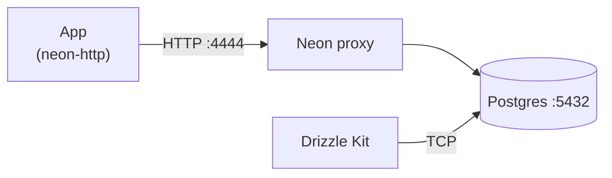

# NextBigApp

Web app for my next big SvelteKit project. Product scope and domain rules live in [`docs/product.md`](docs/product.md).

## Tech Stack

- **Framework**: [SvelteKit](https://kit.svelte.dev/) 2 + [Svelte](https://svelte.dev/) 5
- **Language**: TypeScript
- **Styling**: [Tailwind CSS](https://tailwindcss.com/) 4 + [Bits UI](https://bits-ui.com/) (headless)
- **Database**: [PostgreSQL](https://www.postgresql.org/) 17 (Docker locally, [Neon](https://neon.tech/) in production)
- **ORM**: [Drizzle](https://orm.drizzle.team/)
- **Deploy**: [Vercel](https://vercel.com/) (`main` branch only)
- **Testing**: [Vitest](https://vitest.dev/) (unit + browser component tests)
- **Package manager**: [Bun](https://bun.sh/)

## Quick Start

### Prerequisites

- [Bun](https://bun.sh/)
- [Docker Desktop](https://www.docker.com/products/docker-desktop/)

### Setup

```bash
bun install
cp .env.example .env
bun dev:up
bun db:push
bun dev
```

Dev server: http://localhost:5173

### Development

```bash
bun dev:up      # start Postgres + Neon proxy (Docker)
bun dev         # SvelteKit dev server
bun dev:down    # stop Docker services
```

## Code Quality

```bash
bun check       # typecheck (svelte-check)
bun format      # Prettier write
bun lint        # ESLint + Prettier check
bun lint:fix    # ESLint fix + Prettier write
```

## Testing

```bash
bun run test        # run all tests once (CI-style)
bun run test:unit   # Vitest watch mode
```

Do not use `bun test` — that invokes Bun's built-in runner, not this project's Vitest setup.

## Database

Same driver stack as production (`@neondatabase/serverless` + `drizzle-orm/neon-http`), with Postgres and a [Neon HTTP proxy](https://neon.com/guides/local-development-with-neon) in Docker (`docker/neon-proxy/`).



Offline: add `127.0.0.1 db.localtest.me` to `/etc/hosts`.

```bash
bun dev:up        # Postgres + Neon proxy (builds proxy image on first run)
bun db:push       # apply schema (requires dev:up)
bun db:generate   # generate migrations
bun db:migrate    # run migrations
bun db:studio     # Drizzle Studio
```

## Git Hooks

[Husky](https://typicode.github.io/husky/) + [lint-staged](https://github.com/okonet/lint-staged):

- **Pre-commit**: lint-staged → typecheck → tests
- **Commit-msg**: [Conventional Commits](https://www.conventionalcommits.org/) via commitlint

## Documentation

- [Product scope](docs/product.md)
- [Worklog / backlog](WORKLOG.md)
